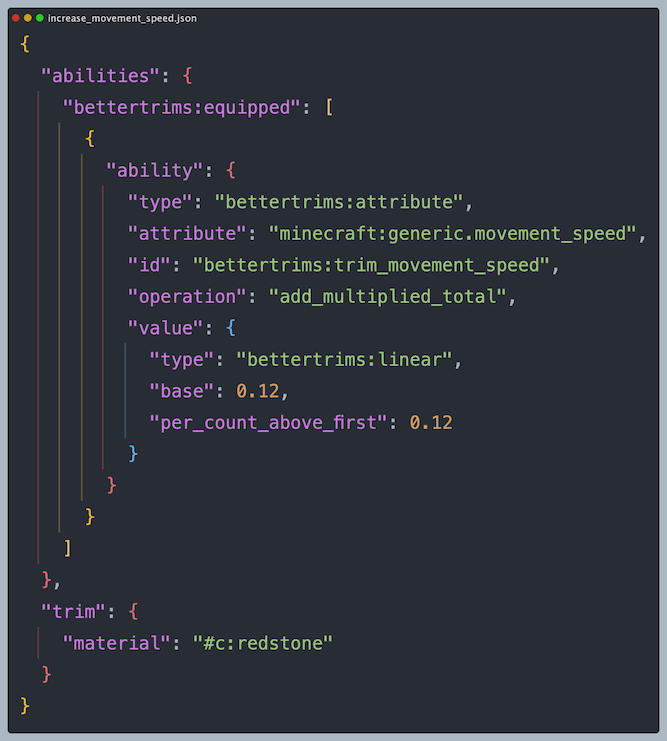
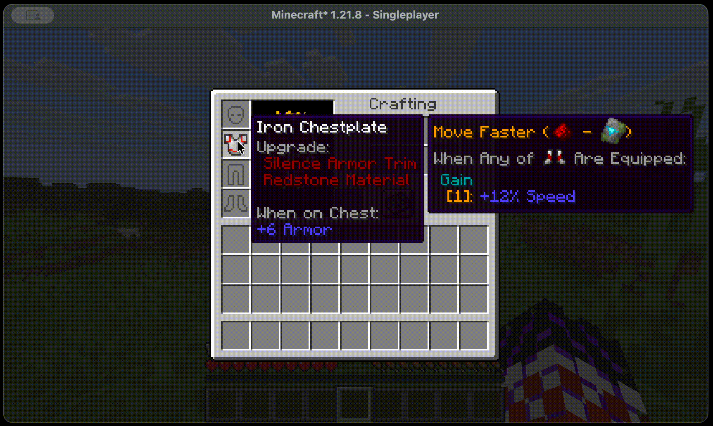

BetterTrims 4.0 :warning: (Not Released Yet)
================
## Gives each armour trim material a unique effect when worn.

#### :warning: For 3.0 go [here](<https://github.com/Bawnorton/BetterTrims/blob/stonecutter/README.md>) :warning:
#### :warning: For 2.0 go [here](<https://github.com/Bawnorton/BetterTrims/blob/main/README.md>) :warning:

### Features
#### Bespoke Data-Driven Armour Trim Property System

    
    

  - Includes Worn Properties, In-World Properties, Set Bonuses and More
  - Almost Infinite Extensbility and Customisation
  - Condition System Based on the [Predicate Data API](https://minecraft.wiki/w/Predicate)
  - Tooltip Inferred From Properties (Mostly translated — there's like 10,000 possible combinations and I am a solo developer)

#### Smart Tooltips
Only Shows Relevant Information Based on Context:

  - Only Visible When Holding Alt/Option 
  - Nested / Complex Conditions Only Expand When Holding Shift
  - Elements Colour Coded Based on Type

#### 2 Datapacks Included
  - **Default**: Similar effects to 2.0 (The more popular version of this mod)
  - **Trim Effects**: Re-implementation and balancing of the [TrimsEffects](https://modrinth.com/mod/trimseffects) mod as a datapack
